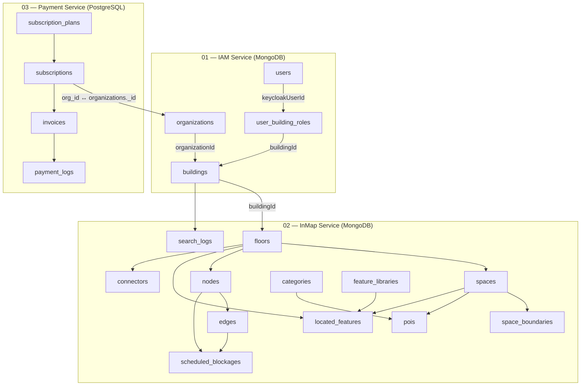

# Database Collections by Service

Tài liệu này tổng hợp toàn bộ collection/table của hệ thống InMap, phân loại theo từng microservice. Hệ thống gồm **3 service** với **2 loại database** khác nhau.

---

## Tổng quan kiến trúc Database

| Service | Database | Engine | Port | Số Collection/Table |
|:--------|:---------|:-------|:-----|:--------------------|
| **01 — IAM Service** | `inmap-iam-db` | MongoDB 6.0 | 27017 | 4 collections |
| **02 — InMap Service** | *(chưa triển khai)* | MongoDB | — | 12 collections |
| **03 — Payment Service** | `payment-db` | PostgreSQL 15 | 5433 | 4 tables |

---

## 01 — IAM Service

> **Database:** MongoDB (`inmap-iam-db`)
> **Port:** 3000
> **Mô tả:** Quản lý danh tính, xác thực (Keycloak), phân quyền RBAC và thông tin tổ chức/tòa nhà.

### 1.1. `users`

**Mô tả:** Lưu trữ thông tin người dùng được đồng bộ từ Keycloak, phục vụ hiển thị hồ sơ và phân quyền toàn cục.
- **Phân vùng:** RBAC Boundary
- **Quan hệ:** Parent of `user_building_roles`

| Trường | Kiểu | Mô tả |
|:-------|:-----|:------|
| `_id` | ObjectId | Khóa chính duy nhất |
| `keycloakUserId` | String | ID tài khoản Keycloak (sub claim) — `unique`, `indexed` |
| `email` | String | Địa chỉ email — `unique` |
| `name` | String | Họ và tên hiển thị |
| `globalRole` | String | `'SYSTEM_ADMIN'` hoặc `'PORTAL_USER'` (default) |
| `createdAt` | Date | Thời điểm tạo (auto — timestamps) |
| `updatedAt` | Date | Thời điểm cập nhật (auto — timestamps) |

> [!NOTE]
> Tài khoản có `globalRole = 'SYSTEM_ADMIN'` tự động bypass qua bảng `user_building_roles` để có toàn quyền hệ thống.

---

### 1.2. `user_building_roles`

**Mô tả:** Bảng trung gian (Junction) ánh xạ quyền quản lý/sở hữu của người dùng đối với từng tòa nhà cụ thể.
- **Phân vùng:** Junction RBAC
- **Quan hệ:** Linked to `users` qua `keycloakUserId`, linked to `buildings` qua `buildingId`

| Trường | Kiểu | Mô tả |
|:-------|:-----|:------|
| `_id` | ObjectId | Khóa chính duy nhất |
| `keycloakUserId` | String | ID Keycloak — `indexed` |
| `buildingId` | String | ID tòa nhà — `indexed` |
| `role` | String | `'OWNER'` hoặc `'MANAGER'` |
| `createdAt` | Date | Thời điểm phân quyền (auto) |
| `updatedAt` | Date | Thời điểm cập nhật (auto) |

**Indexes:**
- Compound unique: `{ keycloakUserId: 1, buildingId: 1 }`

---

### 1.3. `organizations`

**Mô tả:** Quản lý doanh nghiệp hoặc chuỗi sở hữu bất động sản (Multi-Tenant).
- **Phân vùng:** Tenant Definition
- **Quan hệ:** Parent of `buildings`

| Trường | Kiểu | Mô tả |
|:-------|:-----|:------|
| `_id` | ObjectId | Khóa chính duy nhất |
| `name` | String | Tên doanh nghiệp / tổ chức |
| `plan` | String | Gói đăng ký: `'FREE'` (default), `'BASIC'`, `'ENTERPRISE'` |
| `createdAt` | Date | Thời điểm tạo (auto) |
| `updatedAt` | Date | Thời điểm cập nhật (auto) |

---

### 1.4. `buildings`

**Mô tả:** Thực thể cha cao nhất của mỗi cơ sở vật chất, ánh xạ tòa nhà tới tổ chức.
- **Phân vùng:** 1-to-Many Floors
- **Quan hệ:** Linked to `organizations` qua `organizationId`

| Trường | Kiểu | Mô tả |
|:-------|:-----|:------|
| `_id` | ObjectId | Khóa chính duy nhất |
| `buildingId` | String | ID tòa nhà (dùng cho cross-service reference) — `unique`, `indexed` |
| `organizationId` | String | ID tổ chức sở hữu — `indexed` |
| `createdAt` | Date | Thời điểm tạo (auto) |
| `updatedAt` | Date | Thời điểm cập nhật (auto) |

> [!IMPORTANT]
> Trong IAM Service, `buildings` chỉ lưu thông tin tham chiếu tối thiểu (`buildingId`, `organizationId`) để phục vụ phân quyền. Dữ liệu chi tiết của tòa nhà (`name`, `addressLabel`, `totalFloors`) được quản lý bởi InMap Service.

---

## 02 — InMap Service

> **Database:** MongoDB *(chưa triển khai — dự kiến)*
> **Port:** 3001
> **Mô tả:** Quản lý toàn bộ dữ liệu bản đồ, không gian, đồ thị định tuyến, POI và analytics.

### 2.1. `buildings` *(extended)*

**Mô tả:** Lưu trữ thông tin chi tiết tòa nhà (tên, địa chỉ, tổng số tầng).
- **Phân vùng:** 1-to-Many Floors
- **Quan hệ:** Linked to `organizations` (IAM). Parent of `floors`.

| Trường | Kiểu | Mô tả |
|:-------|:-----|:------|
| `_id` | ObjectId | Khóa chính duy nhất |
| `organizationId` | ObjectId | Liên kết tới tổ chức sở hữu (cross-service) |
| `name` | String | Tên tòa nhà (ví dụ: 'AEON Mall Long Biên') |
| `addressLabel` | String | Địa chỉ thực tế |
| `totalFloors` | Number | Tổng số tầng hiện có |
| `createdAt` | Date | Thời điểm tạo |
| `updatedAt` | Date | Thời điểm cập nhật |

---

### 2.2. `floors`

**Mô tả:** Quản lý dữ liệu sơ đồ ảnh từng tầng, kích thước không gian ảo và tỷ lệ pixel-to-meter.
- **Phân vùng:** Scale Reference Layer
- **Quan hệ:** Linked to `buildings`. Parent of `spaces`, `nodes`, `located_features`, `connectors`.

| Trường | Kiểu | Mô tả |
|:-------|:-----|:------|
| `_id` | ObjectId | Khóa chính duy nhất |
| `buildingId` | ObjectId | Liên kết tới tòa nhà |
| `floorNumber` | Number | Vị trí tầng (0: trệt, 1: lầu 1, -1: hầm) |
| `floorPlanImageUrl` | String | URL sơ đồ mặt bằng PNG |
| `dimensions` | Object | Kích thước lưới ảo `{ width, height }` |
| `scale` | Number | Tỷ lệ pixel → mét (ví dụ: 0.15) |
| `createdAt` | Date | Thời điểm tải sơ đồ |
| `updatedAt` | Date | Thời điểm sửa đổi |

---

### 2.3. `spaces`

**Mô tả:** Lưu trữ ranh giới hình học đa giác (2D Polygon) và chiều cao tường của phòng, hành lang, sảnh để phục vụ dựng 3D.
- **Phân vùng:** 2D Polygon Geometry
- **Quan hệ:** Linked to `floors`. Parent of `pois`, `located_features`, `space_boundaries`.

| Trường | Kiểu | Mô tả |
|:-------|:-----|:------|
| `_id` | ObjectId | Khóa chính duy nhất |
| `floorId` | ObjectId | Liên kết tới tầng |
| `spaceCode` | String | Mã định danh ('RM-101', 'HW-02') |
| `spaceLabel` | String | Nhãn hiển thị ('Phòng họp A') |
| `type` | String | `'ROOM'`, `'CORRIDOR'`, `'HALLWAY'`, `'LOBBY'`, `'UTILITY'`, `'OTHER'` |
| `height` | Number | Chiều cao tường 3D (mét) |
| `geometry` | Object | `{ type: 'POLYGON', points: [{ x, y }], center: { x, y } }` |
| `doorNodeId` | ObjectId | Nút đồ thị trước cửa/lối vào (nullable) |
| `createdAt` | Date | Thời điểm tạo |
| `updatedAt` | Date | Thời điểm cập nhật |

---

### 2.4. `space_boundaries`

**Mô tả:** Mô tả chi tiết từng cạnh ranh giới (tường, cửa, ô thoáng) của đa giác không gian, phục vụ render tường 3D.
- **Phân vùng:** 3D Wall Segment Details
- **Quan hệ:** Linked to `spaces`.

| Trường | Kiểu | Mô tả |
|:-------|:-----|:------|
| `_id` | ObjectId | Khóa chính duy nhất |
| `spaceId` | ObjectId | Không gian sở hữu cạnh ranh giới |
| `seqNo` | Number | Thứ tự cạnh (0-indexed) |
| `startPoint` | Object | Điểm bắt đầu `{ x, y }` |
| `endPoint` | Object | Điểm kết thúc `{ x, y }` |
| `boundaryType` | String | `'wall'`, `'opening'`, `'door'`, `'shared'`, `'unknown'` |
| `adjacentSpaceId` | ObjectId | Không gian kề cận (nullable) |
| `hasWall` | Boolean | true = cần render tường 3D |
| `createdAt` | Date | Thời điểm tạo |
| `updatedAt` | Date | Thời điểm cập nhật |

---

### 2.5. `categories`

**Mô tả:** Danh mục phân loại các điểm đến (POI) — cho phép lọc và tìm kiếm theo nhóm ngành.
- **Phân vùng:** Category Index
- **Quan hệ:** Parent of `pois`

| Trường | Kiểu | Mô tả |
|:-------|:-----|:------|
| `_id` | ObjectId | Khóa chính duy nhất |
| `name` | String | Tên danh mục ('Fast Food', 'Fashion') |
| `nameLocalized` | Object | `{ vi: 'Đồ ăn nhanh', en: 'Fast Food' }` |
| `icon` | String | Icon/emoji đại diện ('🍔', 'utensils') |
| `sortOrder` | Number | Thứ tự hiển thị |
| `createdAt` | Date | Thời điểm tạo |
| `updatedAt` | Date | Thời điểm cập nhật |

---

### 2.6. `pois`

**Mô tả:** Đại diện cho thương hiệu / dịch vụ / tiện ích đang chiếm giữ một không gian. Lớp dữ liệu thay đổi khi người thuê thay đổi.
- **Phân vùng:** Dynamic Tenant Layer
- **Quan hệ:** Linked to `spaces` và `categories`.

| Trường | Kiểu | Mô tả |
|:-------|:-----|:------|
| `_id` | ObjectId | Khóa chính duy nhất |
| `spaceId` | ObjectId | Không gian đang chiếm giữ |
| `categoryId` | ObjectId | Danh mục phân loại |
| `name` | String | Tên thương hiệu ('KFC', 'Highlands Coffee') |
| `nameLocalized` | Object | `{ vi: '...', en: '...' }` |
| `description` | String | Mô tả chi tiết |
| `keywords` | Array\<String\> | Từ khóa tìm kiếm |
| `logoUrl` | String | URL logo thương hiệu |
| `contactInfo` | Object | `{ phone, email, website }` |
| `openingHours` | Object | `{ mon: '09:00-22:00', ... }` |
| `active` | Boolean | true = đang hoạt động |
| `createdAt` | Date | Thời điểm tạo |
| `updatedAt` | Date | Thời điểm cập nhật |

---

### 2.7. `nodes`

**Mô tả:** Các đỉnh (Vertices) của mạng lưới định tuyến, có tọa độ 3D và loại (hành lang, ngã rẽ, cửa...).
- **Phân vùng:** Graph Mathematics Vertices
- **Quan hệ:** Linked to `floors`, `edges`, `connectors`, `located_features`, `scheduled_blockages`.

| Trường | Kiểu | Mô tả |
|:-------|:-----|:------|
| `_id` | ObjectId | Khóa chính duy nhất |
| `floorId` | ObjectId | Liên kết tới tầng |
| `locatedFeatureId` | ObjectId | Đối tượng vật lý tương ứng (nullable) |
| `type` | String | `'CORRIDOR'`, `'DOOR'`, `'JUNCTION'`, `'ELEVATOR'`, `'STAIR'` |
| `coords` | Object | `{ x, y, z }` (mét) |
| `active` | Boolean | false = ngưng định tuyến qua |
| `metadata` | Object | Nhãn bổ sung `{ label: '...' }` |
| `createdAt` | Date | Thời điểm tạo |
| `updatedAt` | Date | Thời điểm cập nhật |

---

### 2.8. `edges`

**Mô tả:** Các cạnh (Edges) kết nối giữa các nút, lưu sẵn khoảng cách Euclid cho thuật toán A*.
- **Phân vùng:** Weighted Routing Paths
- **Quan hệ:** Linked to `nodes`, `scheduled_blockages`.

| Trường | Kiểu | Mô tả |
|:-------|:-----|:------|
| `_id` | ObjectId | Khóa chính duy nhất |
| `fromNodeId` | ObjectId | Nút xuất phát |
| `toNodeId` | ObjectId | Nút kết thúc |
| `distance` | Number | Khoảng cách mét (tính trước) |
| `accessible` | Boolean | Hỗ trợ xe lăn? |
| `active` | Boolean | Đường đi đang mở? |
| `isEscalator` | Boolean | Là thang cuốn? |
| `isElevator` | Boolean | Là thang máy? |
| `isStairs` | Boolean | Là thang bộ? |
| `createdAt` | Date | Thời điểm tạo |
| `updatedAt` | Date | Thời điểm cập nhật |

---

### 2.9. `connectors`

**Mô tả:** Hệ thống giao thông đứng (thang máy, thang cuốn, thang bộ), chứa danh sách nút dừng ở từng tầng.
- **Phân vùng:** Global Multi-Floor Bridges
- **Quan hệ:** Linked to `floors`, groups `nodes` để chuyển tầng.

| Trường | Kiểu | Mô tả |
|:-------|:-----|:------|
| `_id` | ObjectId | Khóa chính duy nhất |
| `buildingId` | ObjectId | Liên kết tới tòa nhà |
| `type` | String | `'ELEVATOR'`, `'STAIR'`, `'ESCALATOR'` |
| `name` | String | Tên trục thẳng đứng |
| `active` | Boolean | Trạng thái hoạt động |
| `servedFloors` | Array\<Object\> | `[{ floorId, nodeId }]` |
| `createdAt` | Date | Thời điểm tạo |
| `updatedAt` | Date | Thời điểm cập nhật |

---

### 2.10. `scheduled_blockages`

**Mô tả:** Lịch bảo trì và chặn đường tạm thời, tự động hóa đóng cửa cạnh/nút theo thời gian.
- **Phân vùng:** Software Schedule
- **Quan hệ:** Linked to `nodes` và `edges`.

| Trường | Kiểu | Mô tả |
|:-------|:-----|:------|
| `_id` | ObjectId | Khóa chính duy nhất |
| `name` | String | Tên sự kiện bảo trì |
| `nodeId` | ObjectId | Nút bị chặn (nullable) |
| `edgeId` | ObjectId | Cạnh bị chặn (nullable) |
| `start` | Date | Bắt đầu chặn |
| `end` | Date | Kết thúc chặn |
| `recurring` | Object | `{ type: 'ONCE'\|'DAILY'\|'WEEKLY', daysOfWeek, startTime, endTime }` |
| `reason` | String | Lý do chặn đường |
| `status` | String | `'active'`, `'inactive'`, `'scheduled'` |
| `createdAt` | Date | Thời điểm tạo |
| `updatedAt` | Date | Thời điểm cập nhật |

---

### 2.11. `search_logs`

**Mô tả:** Nhật ký tìm kiếm và lộ trình khách hàng, phục vụ analytics và heatmap.
- **Phân vùng:** Analytics Store
- **Quan hệ:** Linked to `buildings`.

| Trường | Kiểu | Mô tả |
|:-------|:-----|:------|
| `_id` | ObjectId | Khóa chính duy nhất |
| `buildingId` | ObjectId | Tòa nhà diễn ra tìm kiếm |
| `startNodeId` | ObjectId | Điểm xuất phát |
| `endNodeId` | ObjectId | Điểm đích |
| `queryText` | String | Từ khóa tìm kiếm thô |
| `timestamp` | Date | Thời gian tìm kiếm |

---

### 2.12. `located_features`

**Mô tả:** Thực thể vật thể/thiết bị cụ thể đã bố trí trên mặt bằng (camera, máy bán nước, ghế sofa...).
- **Phân vùng:** Spatial Instance Layer
- **Quan hệ:** Linked to `floors`, `spaces`, `feature_libraries`. Trỏ từ `nodes`.

| Trường | Kiểu | Mô tả |
|:-------|:-----|:------|
| `_id` | ObjectId | Khóa chính duy nhất |
| `floorId` | ObjectId | Tầng chứa đối tượng |
| `spaceId` | ObjectId | Không gian chứa (nullable) |
| `libraryId` | ObjectId | Mẫu thiết kế từ `feature_libraries` |
| `geometry` | Object | `{ x, y, rotation, scale }` |
| `customProperties` | Object | Thuộc tính ghi đè (serial, ngày bảo trì...) |
| `createdAt` | Date | Thời điểm tạo |
| `updatedAt` | Date | Thời điểm cập nhật |

---

### 2.13. `feature_libraries`

**Mô tả:** Thư viện mẫu BIM/CAD — danh mục thiết bị, mô hình 3D GLTF và thông số mặc định.
- **Phân vùng:** BIM / CAD Library Catalog
- **Quan hệ:** Parent of `located_features`.

| Trường | Kiểu | Mô tả |
|:-------|:-----|:------|
| `_id` | ObjectId | Khóa chính duy nhất |
| `name` | String | Tên mẫu ('Camera dome AXIS P3245') |
| `category` | String | Nhóm: `'security'`, `'furniture'`, `'iot'`, `'signage'` |
| `modelUrl` | String | URL mô hình 3D GLTF/GLB |
| `icon` | String | Icon trên bản vẽ 2D |
| `defaultProperties` | Object | Thuộc tính mặc định (nhà SX, công suất...) |
| `createdAt` | Date | Thời điểm tạo |
| `updatedAt` | Date | Thời điểm cập nhật |

---

## 03 — Payment Service

> **Database:** PostgreSQL (`payment-db`)
> **Port:** 3002
> **Mô tả:** Xử lý thanh toán B2B subscription qua SePay, quản lý gói đăng ký và hóa đơn. Đồng bộ trạng thái `plan` với IAM Service qua HTTP.

> [!NOTE]
> Payment Service sử dụng **PostgreSQL** (TypeORM) thay vì MongoDB vì dữ liệu thanh toán/hóa đơn phù hợp với mô hình quan hệ.

### 3.1. `subscription_plans`

**Mô tả:** Bảng seed data chứa catalogue các gói đăng ký dịch vụ.

| Trường | Kiểu | Mô tả |
|:-------|:-----|:------|
| `id` | UUID (PK) | Khóa chính |
| `name` | VARCHAR | `'FREE'`, `'BASIC'`, `'ENTERPRISE'` |
| `billing_cycle` | VARCHAR | `'MONTHLY'`, `'YEARLY'` |
| `price_vnd` | BIGINT | Giá (VND) |
| `max_buildings` | INT | Giới hạn tòa nhà (NULL = unlimited) |
| `max_floors` | INT | Giới hạn tầng/tòa nhà (NULL = unlimited) |
| `ai_enabled` | BOOLEAN | Cho phép AI floor plan? |
| `created_at` | TIMESTAMP | Thời điểm tạo |
| `updated_at` | TIMESTAMP | Thời điểm cập nhật |

**Plan Catalogue:**

| Plan | Tháng | Năm | Max Buildings | Max Floors | AI |
|:-----|:------|:----|:--------------|:-----------|:---|
| FREE | 0 ₫ | 0 ₫ | 1 | 5 | ❌ |
| BASIC | 500,000 ₫ | 5,000,000 ₫ | 10 | 20 | ✅ |
| ENTERPRISE | 2,000,000 ₫ | 20,000,000 ₫ | ∞ | ∞ | ✅ |

---

### 3.2. `subscriptions`

**Mô tả:** Quản lý đăng ký dịch vụ của mỗi tổ chức.

| Trường | Kiểu | Mô tả |
|:-------|:-----|:------|
| `id` | UUID (PK) | Khóa chính |
| `org_id` | VARCHAR | Tham chiếu tới `organizations._id` trong IAM MongoDB |
| `plan_id` | UUID (FK) | → `subscription_plans.id` |
| `status` | VARCHAR | `'ACTIVE'`, `'EXPIRED'`, `'CANCELLED'`, `'PENDING_PAYMENT'` |
| `start_date` | TIMESTAMP | Ngày bắt đầu |
| `end_date` | TIMESTAMP | Ngày kết thúc (NULL cho FREE) |
| `auto_renew` | BOOLEAN | Tự động gia hạn (default: true) |
| `created_at` | TIMESTAMP | Thời điểm tạo |
| `updated_at` | TIMESTAMP | Thời điểm cập nhật |

---

### 3.3. `invoices`

**Mô tả:** Hóa đơn thanh toán, theo dõi trạng thái giao dịch SePay.

| Trường | Kiểu | Mô tả |
|:-------|:-----|:------|
| `id` | UUID (PK) | Khóa chính |
| `subscription_id` | UUID (FK) | → `subscriptions.id` |
| `org_id` | VARCHAR | ID tổ chức |
| `amount_vnd` | BIGINT | Số tiền (VND) |
| `billing_cycle` | VARCHAR | `'MONTHLY'`, `'YEARLY'` |
| `status` | VARCHAR | `'PENDING'`, `'PAID'`, `'FAILED'`, `'REFUNDED'` |
| `sepay_order_id` | VARCHAR (UNIQUE) | Mã giao dịch SePay |
| `paid_at` | TIMESTAMP | Thời điểm thanh toán (NULL nếu chưa) |
| `email_sent` | BOOLEAN | Đã gửi email hóa đơn? (default: false) |
| `created_at` | TIMESTAMP | Thời điểm tạo |
| `updated_at` | TIMESTAMP | Thời điểm cập nhật |

---

### 3.4. `payment_logs`

**Mô tả:** Audit trail — lưu mọi sự kiện webhook, đồng bộ và gửi email.

| Trường | Kiểu | Mô tả |
|:-------|:-----|:------|
| `id` | UUID (PK) | Khóa chính |
| `invoice_id` | UUID (FK) | → `invoices.id` |
| `event_type` | VARCHAR | `'SEPAY_WEBHOOK'`, `'IAM_SYNC'`, `'EMAIL_SENT'`, ... |
| `payload` | JSONB | Raw webhook body hoặc response |
| `status` | VARCHAR | `'SUCCESS'`, `'FAILED'` |
| `created_at` | TIMESTAMP | Thời điểm tạo |

---

## Tổng hợp Collection/Table Count

| # | Service | DB Engine | Collection/Table | Count |
|:--|:--------|:----------|:-----------------|:------|
| 1 | IAM Service | MongoDB | `users` | — |
| 2 | IAM Service | MongoDB | `user_building_roles` | — |
| 3 | IAM Service | MongoDB | `organizations` | — |
| 4 | IAM Service | MongoDB | `buildings` | — |
| | | | **IAM Subtotal** | **4** |
| 5 | InMap Service | MongoDB | `buildings` *(extended)* | — |
| 6 | InMap Service | MongoDB | `floors` | — |
| 7 | InMap Service | MongoDB | `spaces` | — |
| 8 | InMap Service | MongoDB | `space_boundaries` | — |
| 9 | InMap Service | MongoDB | `categories` | — |
| 10 | InMap Service | MongoDB | `pois` | — |
| 11 | InMap Service | MongoDB | `nodes` | — |
| 12 | InMap Service | MongoDB | `edges` | — |
| 13 | InMap Service | MongoDB | `connectors` | — |
| 14 | InMap Service | MongoDB | `scheduled_blockages` | — |
| 15 | InMap Service | MongoDB | `search_logs` | — |
| 16 | InMap Service | MongoDB | `located_features` | — |
| 17 | InMap Service | MongoDB | `feature_libraries` | — |
| | | | **InMap Subtotal** | **13** |
| 18 | Payment Service | PostgreSQL | `subscription_plans` | — |
| 19 | Payment Service | PostgreSQL | `subscriptions` | — |
| 20 | Payment Service | PostgreSQL | `invoices` | — |
| 21 | Payment Service | PostgreSQL | `payment_logs` | — |
| | | | **Payment Subtotal** | **4** |
| | | | **TỔNG CỘNG** | **21** |

> [!TIP]
> Collection `buildings` xuất hiện ở cả IAM Service (dạng rút gọn cho RBAC) và InMap Service (dạng đầy đủ cho bản đồ). Hai bản ghi liên kết qua trường `buildingId` / `_id`.
